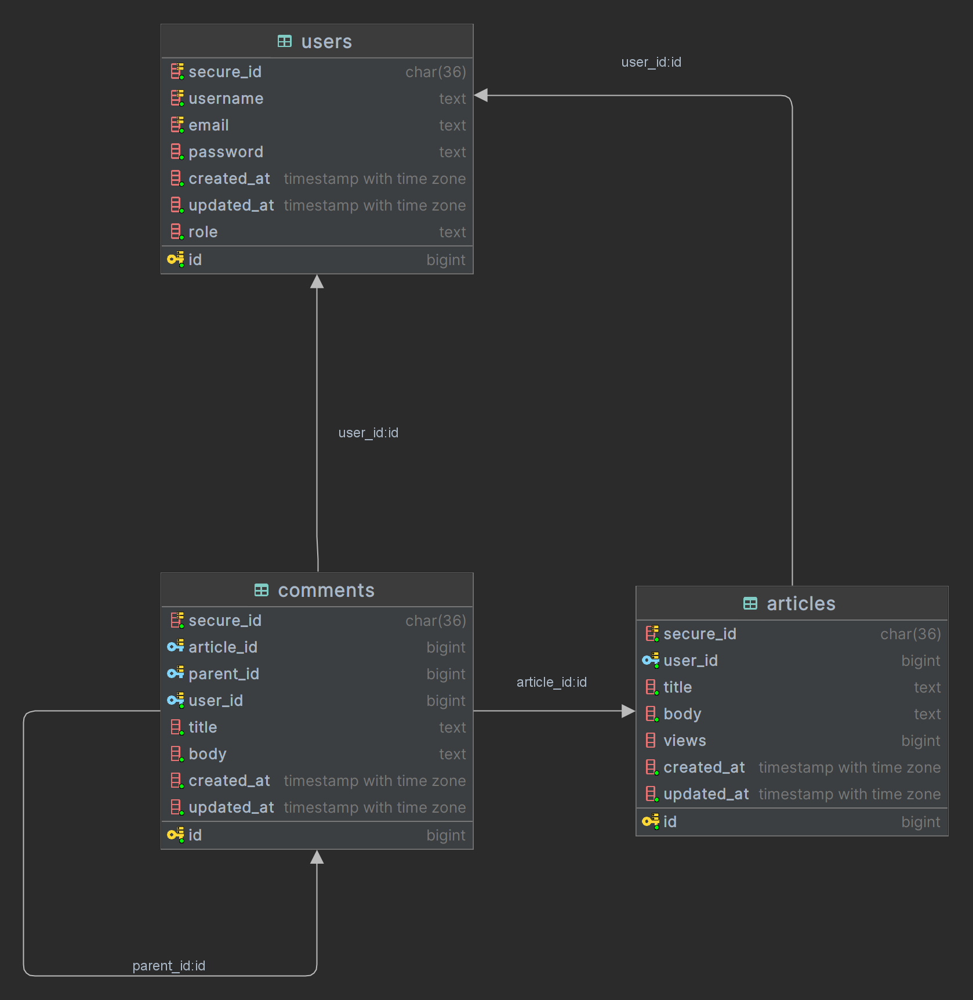

# Artikel Online - Backend

## Deskrpsi
Backend yang dibuat adalah backend untuk platform Artikel Online, dibuat menggunakan Go dan framework Gin.

## Fitur
Berikut adalah fitur yang ada pada aplikasi ini, (catatan, semua endpoint memiliki baseUrl `/api/v1`):

1. Authentication dan Authorization

| Fitur        | Method | Endpoint         | Authenticated | Deskripsi                               |
|--------------|--------|------------------|---------------|-----------------------------------------|
| Register     | POST   | `/auth/register` | ❌             | Register user baru                      |
| Login        | POST   | `/auth/login`    | ❌             | Login user                              |
| Current User | GET    | `/auth/me`       | ✅             | Mendapatkan data user yang sedang login |

2. User Management

| Fitur          | Method | Endpoint         | Authenticated | Deskripsi                                                                                  |
|----------------|--------|------------------|---------------|--------------------------------------------------------------------------------------------|
| View All User  | GET    | `/users`         | ✅ `admin`     | Untuk melihat semua user yang ada,  dapat diberikan parameter `page`, `limit` dan `search`  |
| View All Admin | GET    | `/users/admins`  | ✅ `admin`     | Untuk melihat semua admin yang ada,  dapat diberikan parameter `page`, `limit` dan `search` |
| Get User       | GET    | `/users/{id}`    | ✅ `admin`     | Untuk melihat sebuah user berdasarkan `id`                                                 |
| Promote User   | PUT    | `/users/promote` | ✅ `admin`     | Untuk mengubah role user menjadi admin                                                     |
| Demote Admin   | PUT    | `/users/demote`  | ✅ `admin`     | Untuk mengubah role admin menjadi user                                                     |

3. Article Management

| Fitur             | Method | Endpoint         | Authenticated       | Deskripsi                                                                                    |
|-------------------|--------|------------------|---------------------|----------------------------------------------------------------------------------------------|
| View All Articles | GET    | `/articles`      | ✅                   | Untuk melihat semua artikel yang ada,  dapat diberikan parameter `page`, `limit` dan `search` |
| Get Article       | GET    | `/articles/{id}` | ✅                   | Untuk mendapatkan sebuah artikel berdasarkan `id`                                            |
| Create Article    | POST   | `/articles`      | ✅                   | Untuk membuat sebuah artikel baru                                                            |
| Update Article    | PUT    | `/articles/{id}` | ✅ `admin` `creator` | Untuk mengubah sebuah artikel                                                                |
| Delete Article    | DELETE | `/articles/{id}` | ✅ `admin` `creator` | Untuk menghapus sebuah artikel                                                               |

3. Comment Management

| Fitur                 | Method | Endpoint                  | Authenticated       | Deskripsi                                                                                             |
|-----------------------|--------|---------------------------|---------------------|-------------------------------------------------------------------------------------------------------|
| View Article Comments | GET    | `/articles/{id}/comments` | ✅                   | Untuk melihat semua komen dari sebuah artikel.  Dapat diberikan parameter `page`, `limit` dan `search` |
| Get Comment           | GET    | `/comments/{id}`          | ✅                   | Untuk mendapatkan sebuah komentar berdasarkan `id`                                                    |
| Create Comment        | POST   | `/comments`               | ✅                   | Untuk membuat sebuah komentar baru                                                                    |
| Update Comment        | PUT    | `/articles/{id}`          | ✅ `admin` `creator` | Untuk mengubah sebuah komentar                                                                        |
| Delete Comment        | DELETE | `/articles/{id}`          | ✅ `admin` `creator` | Untuk menghapus sebuah komentar                                                                       |

## Database

Database yang digunakan adalah PostgreSQL, berikut adalah struktur database yang digunakan:

